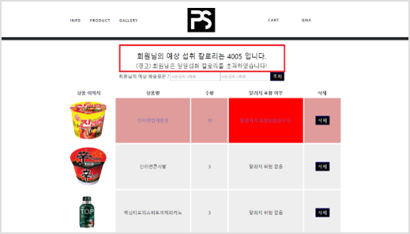
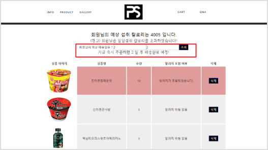

# Personal Shopper :dango:

## 0. 개요

* 회원별 음식 데이터 관리 웹 사이트(찜, 장바구니, 검색 관리, 배송 등)
* Vue를 통한 SPA 구현
* Spring Boot를 통한 MVVM 패턴 구현

## 1. 사용 기술

**[Backend]**
* SpringBoot :
* Mybatis :

**[Frontend]**
* Vue : 
* Bootstrap : 

**[DB]**
* Mysql

## 2. 개발 계획

* 진행 기간 : 2019.10 ~ 2019.12

## 3. DB 모델링

*  

## 4. 핵심 기능

### 1) 검색 기능

* 항목별 검색
* 최다 검색 순위

### 2) 회원별 관리

* 로그인/로그아웃
* 정보 수정/조회
* 알레르기 위험 표시
* 일일 최대 칼로리 표기
* 배송 소요 일자 
* QnA 등록/수정/삭제/조회 기능

### 3) 음식 관리

* 상세 정보(vue pie를 통한 통계 화면)
* 수량 추가 및 삭제
* 알러지 포함 여부 확인

## 5. 스크린 샷
**[일일 최대 칼로리]**

**[배송관련 페이지]**

## 6. 느낀 점

* Git, JIRA를 이용한 협업 능력 향상
* MVC패턴 및 MVVM 패턴 경험
